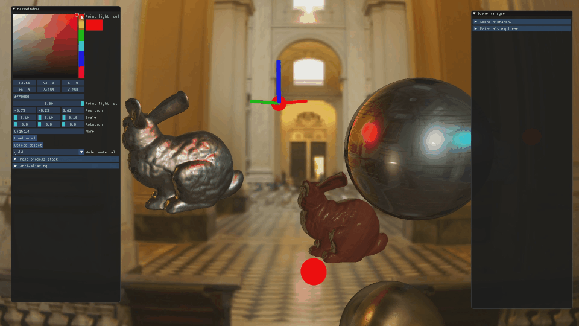
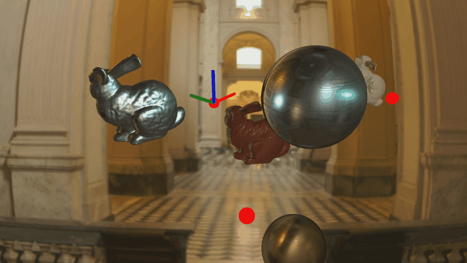
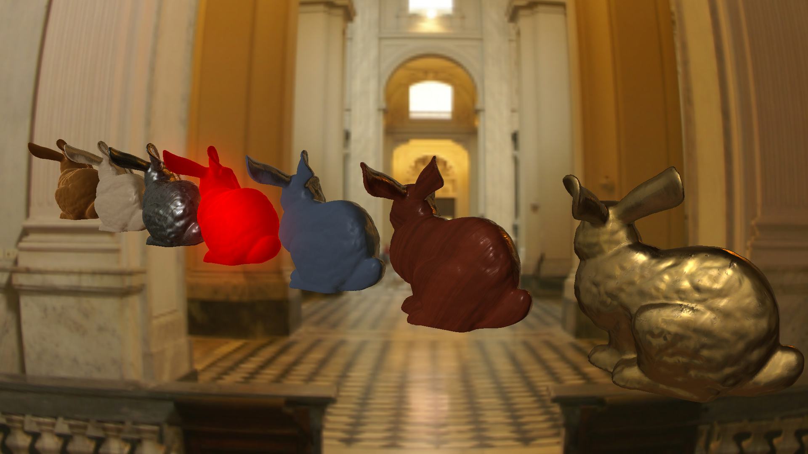

<h1>LEngine: Forward Rendering Engine DirectX11</h1>

tl;dr <b>Watch 1 minute reel!</b>
 

LEngine is a based on PBR and IBL created in DirectX11 using DirectXTK (newer version of deprecated D3DX).
Allows to generate materails through UE4-like system using only visual tools. Managing scene using only visual tools. Full postprocess stack with antialiasing options.

<h3>Gallery:</h3>

<i>PBR IBL - metallic/roughness comparision</i>

<i>Multiple point light - changing position</i>

<i>Multiple point light - changing color</i>

<i>Materials created using Materials Editor system</i>

<h3>Main Features:</h3>
 <ul>
  <li>Physically Based Rendering pipeline (metallic workflow)</li>
  <li>Image Based diffuse/specular Lighting (Skybox IBL)</li>  
 <li>Multiple directional lights; Multiple editable point lights</li>
  <li>Full postprocess stack: SSAO, LUT, Bloom, Chromatic Aberration, Grain</li>
  <li>Antialiasing: FXAA, SSAA</li>  
 <li>Material system - sharing material between objects to reduce rendering costs</li>
 <li>Generating materials through UE4-like editor</li>
 <li>Managing scene: adding new models, changing transforms, moving on scene, adding point lights</li>
 <li>Raypicking OBB</li>
 <li>Importing .obj/.fbx files and storing them in binary format for further usage</li>
</ul>

<h3>References:</h3>
<ul>
  <li><a href="http://www.rastertek.com/tutdx11.html">Rasterek: DirectX11</a> - good place to start programming in DirectX11</li>
  <li><a href="https://learnopengl.com/PBR/Theory">LearnOpenGL: PBR</a> - PBR explained, theory behind IBL. Forumulas and implementation of both of them</li> 
  <li><a href="https://himanshupaul.com/2018/03/13/physically-based-rendering-directx-11/">Himanshu Paul: PBR DirectX11 implementation</a> - reference to implement IBL in DirectX11 engine</li>
  <li><a href="https://github.com/Angelo1211/HybridRenderingEngine">HybridRenderingEngine</a> - my personal source of motivation and mine of great references and ideas</li>
   <li><a href="https://www.gamedev.net/forums/topic/703964-ray-obb-intersection-test-valid-only-for-90-and-180-deg/?page=2&tab=comments#comment-5413521">OBB thread</a> - helpful thread for understanding OBB (in that case, transforming AABB ray and origin to OBB space to perform raypicking)</li>
   <li><a href="http://blog.simonrodriguez.fr/articles/30-07-2016_implementing_fxaa.html">FXAA implementation</a> - blogpost explaining simple FXAA implementation without using original NVidia FXAA white paper</li>
   <li><a href="http://ogldev.atspace.co.uk/index.html">ogldev OpenGL Tutorials</a> - nice blog, mostly useful for simple lights implementations</li>
   <li><a href="https://mynameismjp.wordpress.com/2012/10/24/msaa-overview/">MJP explaining MSAA</a> - very theoritical discussion about MSAA including signal processing. Very nice to understand how clever it is (check his other blogpost, he's great!)</li>
   <li><a href="https://github.com/TheEvilBanana/PhysicallyBasedRendering">TheEvilBanana Github</a> - some version of lighting were based on that. It's good and easy to implement</li>
 
</ul>

<h3>Other interesting links:</h3>
<ul>
  <li><a href="https://kosmonautblog.wordpress.com/2016/10/02/screen-space-emissive-materials/">Screen Space Emissive Materials</a> - great looking but really expensive implementation</li>
  <li><a href="https://nbertoa.wordpress.com/2016/12/02/directx-12-engine-ambient-occlusion/">SSAO: First Approach</a></li>
   <li><a href="https://nbertoa.wordpress.com/2017/02/04/directx-12-ambient-occlusion-the-second-approach/">SSAO: Second Approach</a></li>
</ul>

<h3>Assets:</h3>
<ul>
  <li><a href="https://3dtextures.me/">3D Textures: PBR texture maps</a></li>
  <li><a href="http://www.humus.name/index.php?page=Textures&start=0">Humus: Skyboxes</a></li>
</ul>

<h3>Dependencies:</h3>
<ul>
  <li><a href="https://github.com/ocornut/imgui">ImGui</a></li>
  <li><a href="https://github.com/microsoft/DirectXTK">DirectXTK</a> - newer version of deprececated D3DX</li>
  <li><a href="https://github.com/microsoft/DirectXTK/wiki/MakeSpriteFont">MakeSpriteFont</a> - part of DirectXTK</li>
  <li><a href="https://www.autodesk.com/developer-network/platform-technologies/fbx-sdk-2019-0">FBX SDK</a></li>  
</ul>

<h3>Special thanks:</h3>
<ul>
  <li><a href="https://computergraphics.stackexchange.com/users/3073/paulhk">PaulHK</a> and whole stackexchange community for patiently answering my questions</li>
  <li><a href="https://www.gamedev.net/profile/118414-mjp/">MJP</a> for helping in a huge amount of threads related to rendering </li>
   <li><a href="https://www.gamedev.net/profile/51412-zakwayda/">Zakwayda</a> for spending few days with me, resolving OBB problems </li>
   <li><a href="https://www.gamedev.net/forums/forum/5-graphics-and-gpu-programming/">Gamedev.net graphics programming forum</a> for being an open and helpful place for begginers </li>
</ul>
