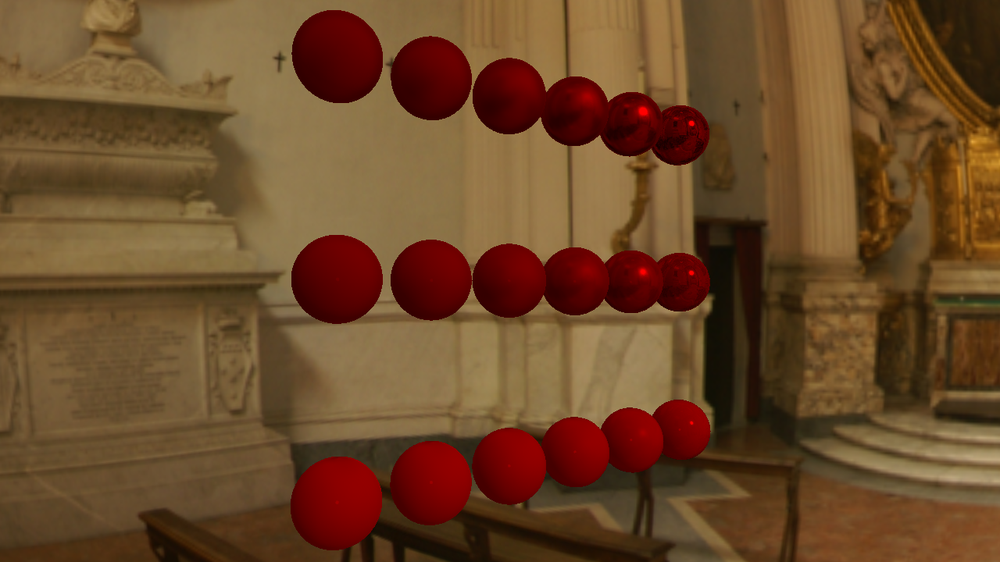
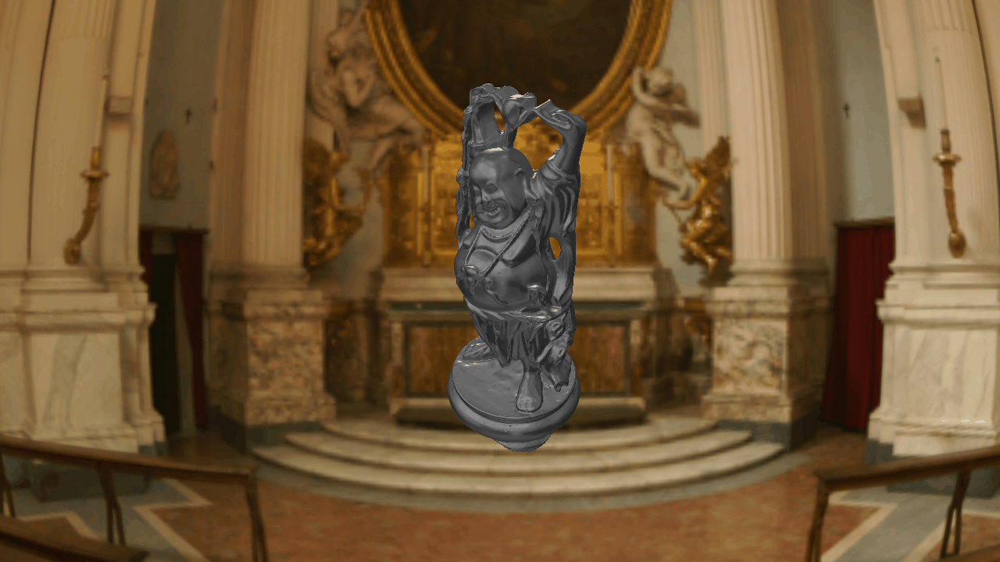
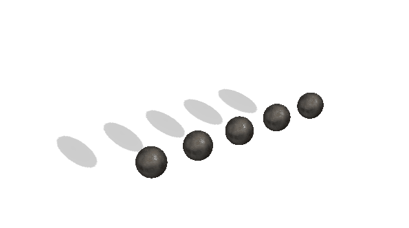

<h1>LEngine: Forward Rendering Engine DirectX11</h1>

LEngine is a based on PBR and IBL created in DirectX11 using DirectXTK (newer version of deprecated D3DX).

<h3>Gallery:</h3>

<i>PBR IBL - metallic/roughness comparision</i>

<i>Multiple directional light passes</i>

<i>Base shadowmapping on multiple objects</i>

<h3>Main Features:</h3>
 <ul>
  <li>Physically Based Rendering pipeline</li>
  <li>Image Based diffuse/specular Lighting (IBL)</li>
  <li>Metallic workflow</li>
 <li>Multiple directional lights (other types will be added)
 <li>Base shadowmapping</li>
  <li>Postprocesses: Screenspace bilinear blur</li>
  <li>Importing .obj files and storing them in binary format for further usage</li>
  <li>Changing PBR input maps on runtime</li>
</ul>

<h3>References:</h3>
<ul>
  <li><a href="http://www.rastertek.com/tutdx11.html">Rasterek: DirectX11</a> - good place to start programming in DirectX11</li>
  <li><a href="https://learnopengl.com/PBR/Theory">LearnOpenGL: PBR</a> - PBR explained, theory behind IBL. Forumulas and implementation of both of them</li> 
  <li><a href="https://himanshupaul.com/2018/03/13/physically-based-rendering-directx-11/">Himanshu Paul: PBR DirectX11 implementation</a> - reference to implement IBL in DirectX11 engine</li>
  <li><a href="https://github.com/Angelo1211/HybridRenderingEngine">HybridRenderingEngine</a> - my personal source of motivation and mine of great references and ideas</li>
</ul>

<h3>Assets:</h3>
<ul>
  <li><a href="https://3dtextures.me/">3D Textures: PBR texture maps</a></li>
  <li><a href="http://www.humus.name/index.php?page=Textures&start=0">Humus: Skyboxes</a></li>
</ul>

<h3>Special thanks:</h3>
<ul>
  <li><a href="https://computergraphics.stackexchange.com/users/3073/paulhk">PaulHK</a> and whole stackexchange community for patiently answering my questions</li>
</ul>
 
<i>Updated 01.04.2019</i>
<h5>Planned April features:</h5>
<ul>
  <li>Introduce post-process stack (SSAO, Bloom, Color grading and posibly more)</li>
  <li>Anti-aliasing</li>
  <li>Point lights</li>
  <li>Shadowmaps improvement</li>
</ul>
